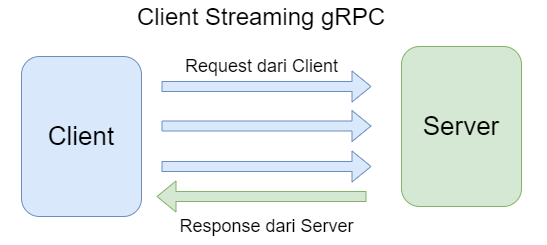
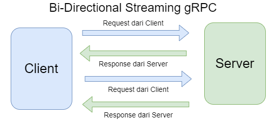

# Golang GRPC Example
### Dependency
1. Install the protocol compiler plugins for Go 
   ```shell
   go install google.golang.org/grpc/cmd/protoc-gen-go-grpc@latest
   go install google.golang.org/protobuf/cmd/protoc-gen-go@latest
   ```
2. add library GRPC
   ```shell
   go get google.golang.org/grpc
   ```

### Compile file .proto
- example:
   ```shell
   protoc --go_out=paths=source_relative:. --go-grpc_out=paths=source_relative:. <path file.proto>
   or
   protoc --go_opt=paths=source_relative --go_out=. --go-grpc_opt=paths=source_relative --go-grpc_out=. helloworld/helloworld.proto
   or 
   protoc -Icalculator/operation --go_opt=module=go-grpc1-example --go_out=. --go-grpc_opt=module=go-grpc1-example --go-grpc_out=. .\calculator\operation\*.proto
   ```

### Evans CLI

1. add ```reflection.Register(s)``` in server, ```s``` is grpc server
2. execute this to run Evans CLI :
   ```shell
   default port (50051): evans -r
   or
   custom port : evans -r -p <port> 
   or 
   evans --host localhost --port 50051 --reflection repl
   ```


### Illustration
1. Server Stream

   

2. Client Stream

   

3. Bi-Direction

   
   