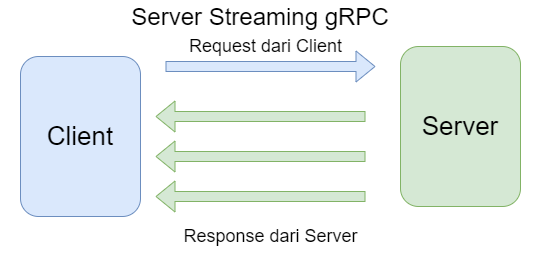
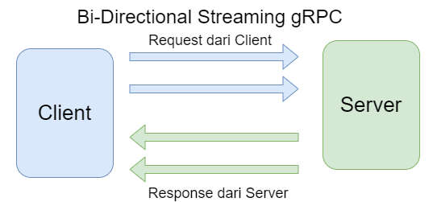

# Golang GRPC Example
### Library
    go get google.golang.org/grpc 
    go install google.golang.org/grpc/cmd/protoc-gen-go-grpc@latest
    go install google.golang.org/protobuf/cmd/protoc-gen-go@latest

### compile file .proto
    protoc --go_out=paths=source_relative:. --go-grpc_out=paths=source_relative:. <path file.proto>
    or
    protoc --go_opt=paths=source_relative --go_out=. --go-grpc_opt=paths=source_relative --go-grpc_out=. helloworld/helloworld.proto
    or 
    protoc -Icalculator/operation --go_opt=module=go-grpc1-example --go_out=. --go-grpc_opt=module=go-grpc1-example --go-grpc_out=. .\calculator\operation\*.proto

### Illustration
1. Server Stream

   

2. Client Stream

   

3. Bi-Direction

   
   